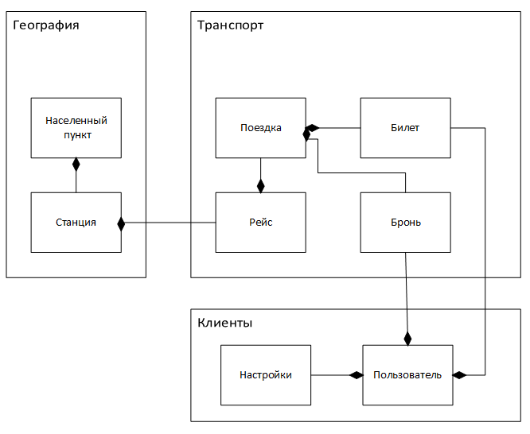

# Project Shine

## ТРАНСПОРТНАЯ СИСТЕМА ПРОДАЖИ И БРОНИРОВАНИЯ БИЛЕТОВ.

### Предметная область реального мира

Объект реального мира - сущность (entity)
- *Имеет идентификатор*
- *Включает атрибуты и поведение*
- *Входит в предметную модель*

Особенности кодовой базы:
- максимальная безопасность и защита от ошибок.
- система реального времени.
- возможность интеграции со сторонними системами.
- расширяемость функционала.

Идея в виде функций:

1. Добавление рейса овопределенного типа транспорта между городами.
2. Поиск рейсов.
3. Бронирование билетов.
4. Покупка билетов.
5. Отмена билетов.
6. Интеграция со сторонними сервисами (социальные сети для авторизации)

### Требования

Номер | Название | Роль | Описание

1 | Добавление населенного пункта | Менеджер | Менеджер заходит на страницу добавления населенного пункта, заполняет необходимые поля и добавляет пункт в систему.

2 | Добавление рейса | Менеджер | Менеджер заходит на страницу добавления рейса, заполняем необходимые поля и добавляет рейс в систему

3 | Поиск рейса | Клиент | Клиент заходит на страницу поиска рейсов, заполняет критерии поиска, и система выдает ему найденные варианты

4 | Бронирование билетов | Клиент | Клиент выбирает один из найденных рейсов, вводит информацию о билете и бронирует его. Система высылает ему информацию о подтверждении бронирования

5 | Покупка билетов | Клиент | Клиент выбирает один из найденных рейсов, вводит информацию о билете и покупает его. Система высылает ему информацию о подтверждении покупки

6 | Покупка бронированных билетов | Клиент | Клиент заходит на страницу своего профиля, выбирает забронированный билет и выкупает его

7 | Отмена бронированных билетов | Клиент | Клиент заходит на страницу своего профиля, выбирает забронированный билет и отменяет его

8 | Отмена истекшей брони | Планировщик системы | Планировщик проверяет все забронированные билеты и отменяет те, для которых истек срок оплаты

### Выбор платформы

- Насколько команда разработчиков знакома с платформой
- Насколько платформа популярна
- Насколько легко изучить ее с нуля или наоборот человеку, уже знакомому с программированием
- Сколько стоят средства разработки, дополнительные библиотеки и плагины

### Архитектура

- Изменение каркаса практически всегда приводит к обрушению строения и создания заново
- Каркас должны создавать самые опытные специалисты
- Для уменьшения риска и затрат по времени предпочтительно использовать типовые решения

#### Архитектурные шаблоны

- Клиент-серверное приложение
- Веб-приложение
- Мобильное приложение
- Сервис-ориентированное приложение. SOA (service-oriented architecture)

#### Многослойная архитектура

0. Слой представления (Отображение данных : presentation layer)
1. Слой приложения (Обработка данных : application layer)
    - Бизнес-логика (domain logic)
        - Описание в XML
    - Бизнес-правила (business rules) - описываем ограничения накладываемые бизнес-правилами.
    - Инфраструктура (infrastructure)
    - Коммуникация (communication)
2. Слой доступа к данным (Хранение или доступ к данным : persistence layer)

~ Бизнес-процессы

- DDD (Domain-Driven Development) - разработка логики в зависимости от взаимосвязей объектов предметной области.
    - Жизненный цикл сущности (entity lifecycle)
        - Создание ---> Развитие ---> Удаление.

- Каждый слой знал и мог обмениваться данными с нижележащим слоем
- Никакой слой не должен знать о вышележащих слоях, а предоставлять только те возможности, которые следуют из его функциональности.

### Функциональные требования

- Гибкость и расширяемость инфраструктуры проекта (подключение различных видов клиентских приложений)
- Хранение данных
- Обработка запросов
- 

___

## Стек технологий

Платформы
- Java SE
- Java EE

Язык программирования
- Java
- Scala
- Clojure
- Groovy

Фреймворки
- Spring
- Hibernate

Библиотеки
- Apache Commons
- Google Guava

Конфигурационные файлы
- XML

## Структура проекта

- Исходные файлы(.java)
- Автоматизированные тесты
- Серверные страницы и HTML (.jsp, .jsf, .html)
- Мультимедиа (.gif, .jpg, .png)
- Скрипты базы данных (.sql)
- Файлы ресурсов (.xml, .properties, .wsdl)
- Вспомогательные файлы для веб (.css, .js)

## Реализация

- Доменная модель
    - Сущности (Entities)
        - Населенный пункт (Locality)
        - ...
    - Рейс (в расписании) (Cruise)
        - Станция отправления (=Object)
        - Станция прибытия (=Object)
        - Километраж (=Integer)
        - Тип транспортного средства (=Object)
    - Расписание (Schedule)
    - Поездка (Trip) транспортного средства по конкретному рейсу
    - Станция (Station) точка остановки в рейсе
    - Билет (Ticket)
    - Пользователь (User)

Системные службы:
- Контроллер (Constroller)
 - ...
- Доступ к данным (DAO)
- Утилиты (Util)
 - Утилиты по работе с сущностями (EntityUtilities)
  - ...
- Сервисы (ServiceImpl)

***Неизменяемый объект (immutable) - мы не можем изменить состояние объекта после его создания.***

